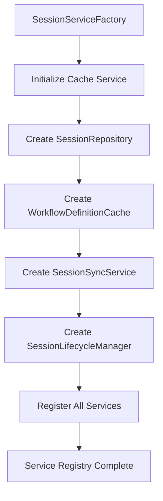

# Service Architecture Documentation

## Overview

The Accordo Workflow MCP project implements a sophisticated service-based architecture with comprehensive dependency injection capabilities that exceeds typical frameworks. This document details the current production-ready service infrastructure.

## Core Components

### ServiceRegistry (Dependency Injection Container)

The `ServiceRegistry` class in `src/accordo_workflow_mcp/services/dependency_injection.py` provides comprehensive dependency injection capabilities:

**Key Features:**
- **Service Registration**: Direct instance registration with protocol validation
- **Factory Pattern Support**: Lazy instantiation through factory functions
- **Singleton Management**: Automatic singleton lifecycle with lazy initialization
- **Protocol Validation**: Automatic validation of service implementations against Protocol interfaces
- **Enhanced Error Handling**: Detailed error context with `ServiceRegistrationError` exceptions

**Registration Methods:**
```python
# Direct service registration
service_registry.register_service(ServiceProtocol, implementation)

# Factory-based registration
service_registry.register_factory(ServiceProtocol, factory_function)

# Singleton registration with lazy initialization
service_registry.register_singleton(ServiceProtocol, factory_function)
```

**Validation Features:**
```python
# Protocol compliance validation
service_registry.validate_registration(protocol, implementation)

# Service registration summary
summary = service_registry.get_registered_services()
```

### Protocol-Based Service Interfaces

The architecture implements comprehensive protocol-based interfaces ensuring type safety and contract compliance:

#### Core Service Protocols

1. **SessionLifecycleManagerProtocol** (`src/accordo_workflow_mcp/services/session_lifecycle_manager.py`)
   - Session cleanup and archival management
   - Lifecycle event handling
   - Resource management capabilities

2. **CacheServiceProtocol** (`src/accordo_workflow_mcp/services/cache_service.py`)
   - Cache abstraction layer
   - Availability checking
   - Cache manager access

3. **ConfigurationServiceProtocol** (`src/accordo_workflow_mcp/services/config_service.py`)
   - Application configuration management
   - Environment-based configuration
   - Platform-specific settings

4. **SessionSyncServiceProtocol** (`src/accordo_workflow_mcp/services/session_sync_service.py`)
   - Session persistence and synchronization
   - File-based session management
   - Cache integration

5. **SessionRepositoryProtocol** (`src/accordo_workflow_mcp/services/session_repository.py`)
   - Session CRUD operations
   - Session state management
   - Data persistence abstraction

6. **WorkflowDefinitionCacheProtocol** (`src/accordo_workflow_mcp/services/workflow_definition_cache.py`)
   - Workflow definition caching
   - Template management
   - Definition retrieval

### Service Factory Pattern

The `SessionServiceFactory` class provides centralized service initialization and management:

**Initialization Flow:**


**Factory Methods:**
- `initialize_session_services()`: Complete service initialization
- `get_session_repository()`: Repository service access
- `get_session_sync_service()`: Sync service access
- `get_session_lifecycle_manager()`: Lifecycle manager access
- `get_workflow_definition_cache()`: Cache service access

### Dependency Injection Patterns

#### Service Registration

Services are registered during application startup:

```python
# Service factory handles registration
factory = SessionServiceFactory(service_registry)
factory.initialize_session_services()

# Manual registration for custom services
service_registry.register_service(CustomProtocol, CustomImplementation())
```

#### Service Resolution

Services are resolved through the registry:

```python
# Direct service access
session_service = get_service(SessionRepositoryProtocol)

# Decorator-based injection
@inject_service(SessionRepositoryProtocol)
def my_function(session_service, other_args):
    return session_service.get_session(session_id)
```

#### Configuration Service Integration

Special integration for configuration services:

```python
@inject_config_service
def configure_feature(config_service, feature_name):
    config = config_service.get_server_config()
    return config.feature_settings[feature_name]
```

### Error Handling and Validation

#### Exception Hierarchy

```python
DependencyInjectionError
├── ServiceRegistrationError  # Registration validation failures
└── Service resolution errors  # Runtime service access failures
```

#### Protocol Validation

Automatic validation ensures implementations satisfy protocol contracts:

- **Method Validation**: Checks for required protocol methods
- **Attribute Validation**: Validates protocol attributes
- **Type Safety**: Ensures proper type compliance
- **Enhanced Error Messages**: Detailed context for validation failures

### Integration with MCP Server

The service architecture integrates seamlessly with the MCP server lifecycle:

1. **Server Startup**: Services initialized via `SessionServiceFactory`
2. **Request Handling**: Services injected into MCP tool handlers
3. **Resource Management**: Proper cleanup through lifecycle managers
4. **Configuration**: Environment-based service configuration

### Testing and Quality Assurance

#### Unit Testing

Comprehensive test coverage with 618 passing tests:

- **ServiceRegistry Tests**: Registration, validation, lifecycle management
- **Protocol Compliance Tests**: Interface contract validation
- **Integration Tests**: Service interaction validation
- **Mock Service Support**: Test isolation capabilities

#### Quality Gates

- **Zero Linting Errors**: `ruff check .` validation
- **Type Safety**: Protocol-based type checking
- **Performance**: Singleton pattern for expensive resources
- **Memory Management**: Proper service lifecycle cleanup

### Best Practices

#### Service Design

1. **Protocol-First Design**: Define protocols before implementations
2. **Single Responsibility**: Each service handles one concern
3. **Dependency Injection**: Avoid direct service instantiation
4. **Interface Segregation**: Multiple focused protocols over large interfaces

#### Registration Patterns

1. **Factory Registration**: Use factories for complex initialization
2. **Singleton Pattern**: For stateful or expensive services
3. **Protocol Validation**: Always validate implementations
4. **Error Handling**: Provide meaningful error contexts

#### Testing Strategies

1. **Service Mocking**: Mock protocol interfaces in tests
2. **Registry Isolation**: Clear registry between tests
3. **Integration Testing**: Test service interactions
4. **Contract Testing**: Validate protocol compliance

### Future Enhancements

While the current architecture is comprehensive, potential enhancements include:

1. **Service Health Monitoring**: Health check protocols
2. **Performance Metrics**: Service performance tracking
3. **Dynamic Reconfiguration**: Runtime service updates
4. **Service Discovery**: Automatic service registration
5. **Distributed Services**: Multi-instance service coordination

## Conclusion

The service architecture in Accordo Workflow MCP represents a sophisticated, production-ready dependency injection framework that exceeds typical DI container capabilities. The protocol-based design ensures type safety, the factory patterns provide proper initialization, and the comprehensive validation ensures contract compliance.

This architecture provides a solid foundation for scalable, maintainable, and testable code while maintaining clear service boundaries and proper separation of concerns. 